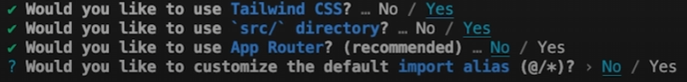
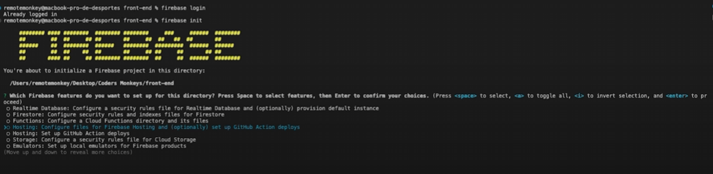

## REACT ICON 

- npm i react-icons


## creation d'un projet full stack next js tsx

- npx create-next*app@latest my-project --typescript --eslint



## TAILWIND CSS

- npm install -D tailwindcss postcss autoprefixer
- npx tailwindcss init -p

## tailwind.config.ts
import type { Config } from "tailwindcss";

```const config: Config = {
  content: [
    "./src/pages/**/*.{js,ts,jsx,tsx,mdx}",
    "./src/ui/**/*.{js,ts,jsx,tsx,mdx}",
    "./src/**/*.{js,ts,jsx,tsx,mdx}",
  ],
  theme: {
    extend: {},
  },
  plugins: [],
};
export default config;
```


**globals.css--->**

@tailwind base;
@tailwind components;
@tailwind utilities;

## firebase install

- npm install firebase

- npm install -g firebase-tools dans le cmd general 

- firebase login
- firebase init 
- firebase deploy



## INTEGRATION IMAGES AVEC NEXT JS

next/images
